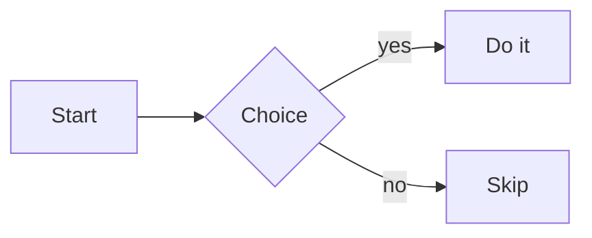
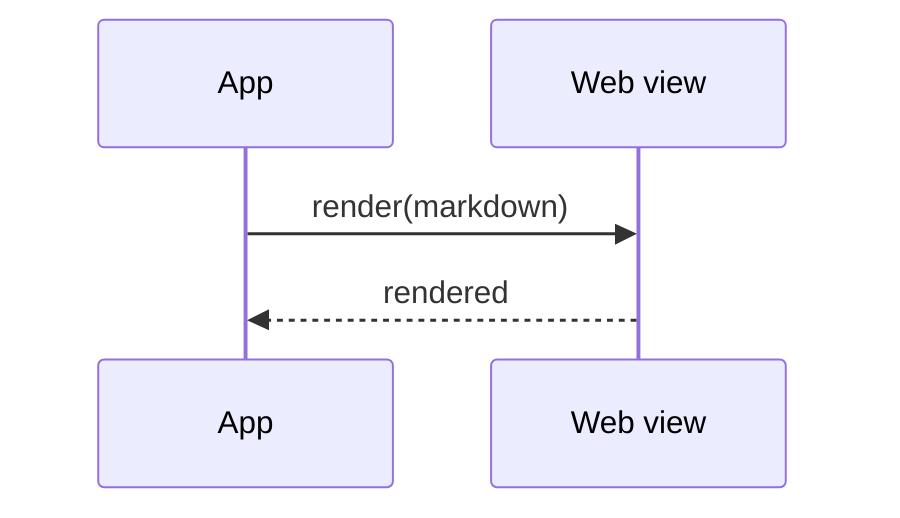
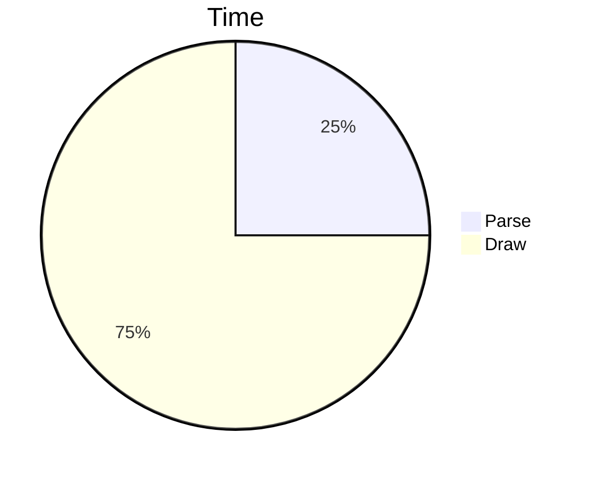
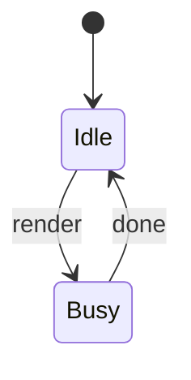
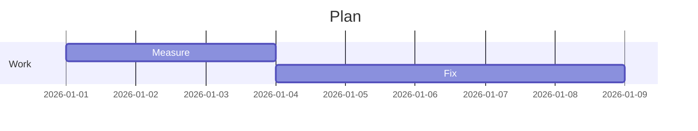
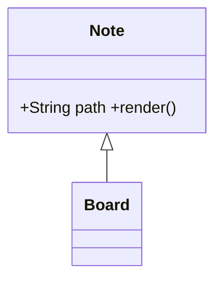

# Mermaid

```mermaid
flowchart LR
  A[Start] --> B{Choice}
  B -->|yes| C[Do it]
  B -->|no| D[Skip]
```

```mermaid
sequenceDiagram
  participant A as App
  participant W as Web view
  A->>W: render(markdown)
  W-->>A: rendered
```

```mermaid
pie title Time
  "Parse" : 10
  "Draw" : 30
```

```mermaid
stateDiagram-v2
  [*] --> Idle
  Idle --> Busy: render
  Busy --> Idle: done
```

```mermaid
gantt
  title Plan
  dateFormat YYYY-MM-DD
  section Work
  Measure :a1, 2026-01-01, 3d
  Fix :after a1, 5d
```

```mermaid
classDiagram
  class Note { +String path +render() }
  Note <|-- Board
```

Invalid:

```mermaid
flowchart LR
  A -->
  ((( not a diagram
```

After the diagrams.
